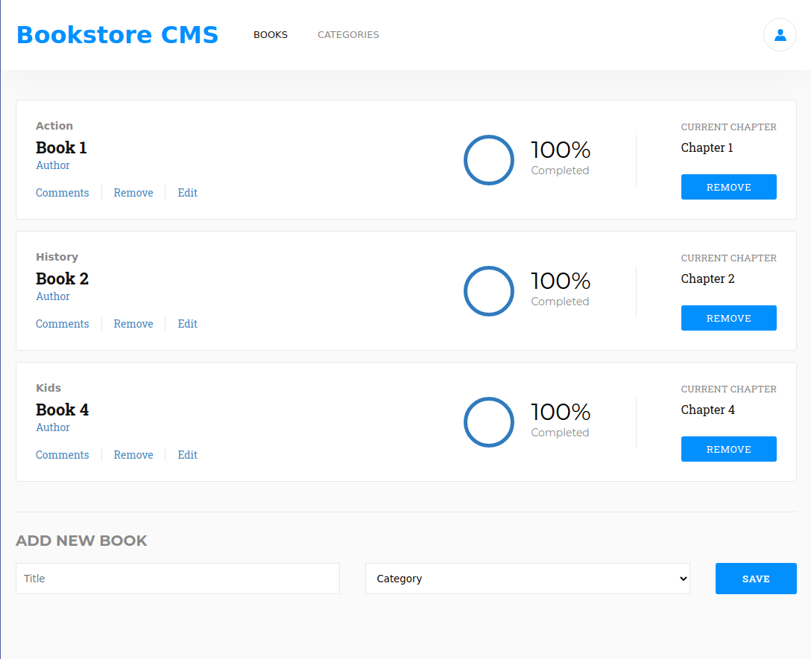

# Bookstore

# Table of Contents
- [Bookstore](#bookstore)
- [Table of Contents](#table-of-contents)
  - [Built With](#built-with)
  - [How to run locally](#how-to-run-locally)
  - [Live Demo](#live-demo)
  - [Authors](#authors)
  - [🤝 Contributing](#-contributing)
  - [Show your support](#show-your-support)
  - [Acknowledgments](#acknowledgments)
  - [License](#license)

## Built With

- JavaScript
- React
- Redux
- React Testing Library
- Jest
- HTML
- CSS
- Node.js
- Webpack
  
## How to run locally

- Install [Node.js](https://nodejs.org/en/)
- Clone this repository by running git clone `https://github.com/WinterCore/microverse-react-capstone-pokemon.git`
- Change your current working directory to the project `cd microverse-react-capstone-pokemon`
- Run `npm install`
- Run `npm start`
- Enjoy

## Live Demo 

[Live Demo Link](https://wintercore-bookstore.herokuapp.com)

## Authors

👤 **Hasan Kharouf**

- Github: [@WinterCore](https://github.com/WinterCore)

## 🤝 Contributing

Contributions, issues and feature requests are welcome!

Feel free to check the [issues page](issues/).

## Show your support

Give a ⭐️ if you like this project!

## Acknowledgments

- Microverse

## License

This project is [MIT](LICENSE) licensed.
